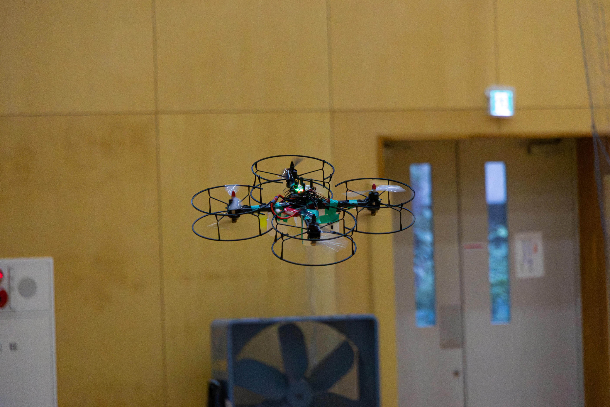
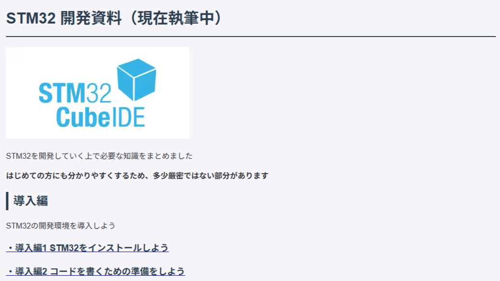
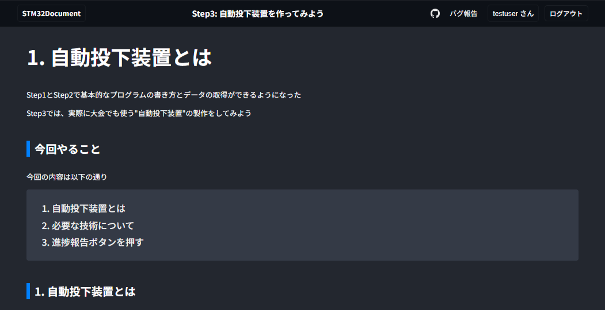

## 自己紹介

- そこら辺に生えてる学部生です
- C++の比較的低レイヤー向けの実装を書いています
- クラス設計たのしい
- 最近C++17と仲良くなりつつある

## 所属先

公開許可を貰っている範囲での記載になります

- 東京農工大学航空研究開会 (2024~) [NokoLAT](https://github.com/NOKOLat)

## 書いている言語

ほんのちょっとわかる

触ったことあるけど意味不明

### 大きめのプロジェクト

#### 1. PFLIGHT - フライトコントローラー

**リポジトリ:** [PFLIGHT](https://github.com/NOKOLat/PFLIGHT)

- 4発 or 8発向けのドローンのフライトコントローラー
- ヨー軸の推定に少し課題がありますが、通常飛行ならこなせます
- 少し古いコードなので実装が微妙なところが多め

#### 2. PFLIGHT2 - 模型飛行機用フライトコントローラー

- 双発模型飛行機の自動操縦を開発中
- ROS2を使ったLiDAR開発に挑戦予定

**リポジトリ** [Lidar_Mid70](https://github.com/NOKOLat/2026_Hikorobo_Lidar)

- Lidarを静置した状態で、データの取得から動体検知までを記載
- configは全部yamlにまとめたので、簡単にチューニングができます
---

### センサー関係

- STM32 HAL向けの実装がほとんどないので自作しています
- IMU、地磁気、気圧、ToF、温度センサーのライブラリや実装サンプルを公開しています
- 数が多いので、リンク先にまとめてあります

**詳細:** [SensorProgram.md](./SensorProgram.md)

---

### 姿勢推定関係

- アルゴリズムは苦手なので、外部の方が作成したものの実装をメインに書いています

#### 1. ComplementaryFilter - 相補フィルタ

**リポジトリ:** [ComplementaryFilter](https://github.com/NOKOLat/ComplementaryFilter)

- 一般的な相補フィルタの実装
- 加速度のノルムを使うことで、急な移動に少し対応

#### 2. Tellicious InertialEstimators - EKF

**リポジトリ:** [Tellicious InertialEstimators EKF](https://github.com/NOKOLat/Tellicious_InertialEstimators_EKF)

- 開発でよく使わせていただいているTelliciousさんのEKFライブラリのサンプルコードです
- 素晴らしいライブラリなので、もうちょっと有名になってほしい気持ち

### 🔧 設計例

- 組み込み向けの設計例を作成したので、公開しています
- std::unique_ptrやstd::optionalを使った低レイヤー向けの（ちょっと）モダンC++を使用しています

#### 1. ESP32_StatePattern_Sample

**リポジトリ:** [ESP32_StatePattern_Sample](https://github.com/aoi-netai/ESP32_StatePattern_Sample)

- Stateパターンのクラスサンプル
- VSCodeのplatformIOなどを使用して実行

#### 2. ROS2_StateMachine_Sample - ROS2の状態機械

**リポジトリ:** [ros2_state_machine_sample](https://github.com/aoi-netai/ros2_state_machine_sample)

- ESP32_StatePattern_SampleのROS2版
- LoggerのインスタンスをContextで共有する実装のほうがよさそう

---

### 📚 ドキュメント

- 後輩への引継ぎ用に作成したドキュメントを公開しています
- STM32を触る人が増えてくれたらうれしいです

#### 1. STM32 初心者向けドキュメント(2025年度)

**URL:** [STM32 DEV Documentation](https://aoi-256.github.io/STM32_DEV/)

- 所属しているサークルの引継ぎ用ドキュメント
- STM32のLチカからセンサーライブラリの作成までを解説

#### 2. STM32 初心者向けドキュメント（2026年度）

**URL:** [STM32_document_React](https://nokolat.github.io/2026_STM32_Document/)

- React + TypeScript + SQLで作成した管理機能付きドキュメント
- ユーザーごとの進捗管理、Discordへの通知を自動でやってくれます
- Web系は更新が速いので、かなり古いバージョンの実装になっていそう
- 現状はサークル内部にのみ公開

### その他のツール

#### 1. SBUS_Generator

**リポジトリ:** [SBUS_Generator](https://github.com/aoi-netai/SBUS_Generator)

- PythonでSBUS信号を生成・送信するツール
- 受信機からくるデータを反転処理したものを出力可能

#### 2. ESP32_P2P_Utility

**リポジトリ:** [ESP32_P2P_Utility](https://github.com/aoi-netai/ESP32_P2P_Utility)

- ESP32のP2P通信ユーティリティ
- ワイヤレス通信の実装サンプル

#### 3. STM32_Motor-Servo_Driver

**リポジトリ:** [STM32_Motor-Servo_Driver](https://github.com/NOKOLat/STM32_Motor-Servo_Driver)

- STM32向けのモーター・サーボドライバライブラリ
- PWM制御による速度・角度制御

#### 4. 1DoF_PID - PID制御

**リポジトリ:** [PFLIGHT_PID](https://github.com/NOKOLat/2025_PFLIGHT_PID)

- 一般的な1軸PID制御
- シンプソン公式を利用したので、積分精度が少しいいかも

## 使用について

- リポジトリに記載がない場合は、MITライセンスで公開しています
- 商用利用、改変、再配布など自由に行っていただいて構いません
- 使用報告、issue、PRなどお待ちしております！
